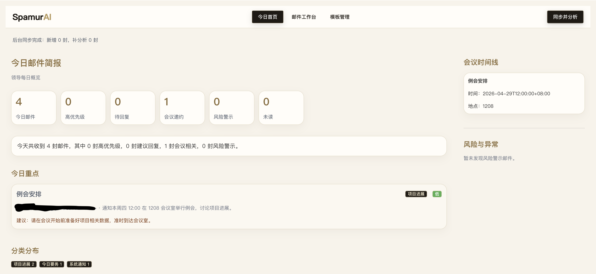
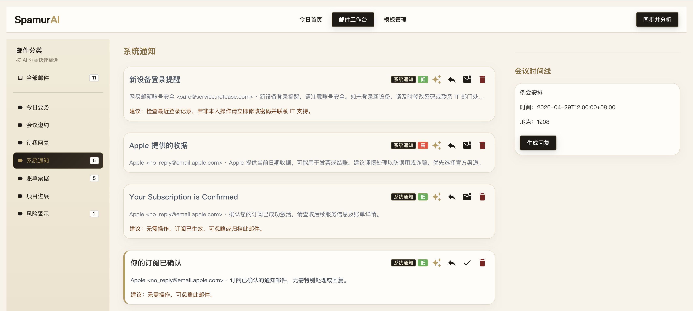
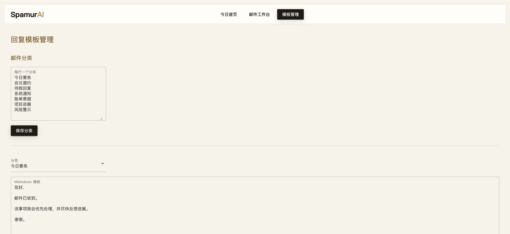

# 📬 AI 邮箱助手

> Your mail, your rule, your AI,your Spam Samurai!

一个跑在本地的 AI 邮箱工作台：把邮件同步、分类、摘要、风险识别、会议整理、回复草稿和模板管理收敛到一个页面里。不仅如此，要分类到哪里，你说了算！它适合每天邮件很多、分类规则又高度个人化的人使用。

重点不是“又一个邮箱客户端”，而是一个可以按你的工作方式生长的邮件秘书。

## 🖼️ 截图

### 🗓️ 今日首页



### 📨 邮件工作台



### 🧩 模板管理



## ✨ 为什么做它

普通邮箱的分类通常太固定：收件箱、星标、垃圾箱，最多再加一些规则。现实工作里，真正有用的分类往往是“今天必须处理”“需要我回复”“客户升级”“会议邀约”“风险警示”“只需归档”。

AI 邮箱助手把分类权交还给你：

- 🏷️ **完全个性化的邮件分类**：分类列表可以在页面里直接改，AI 之后只会从你的分类中选择。
- 📴 **完全离线可靠的 AI 支持**：默认对接本地 Ollama，邮件内容不需要发到云端模型。
- 🔒 **本地优先的数据边界**：邮件数据库、分类、模板都保存在项目本地目录。
- 🧭 **可解释的工作流**：每封邮件都有摘要、优先级、建议动作、会议信息和风险提示。
- ✉️ **从分析到回复闭环**：点击邮件生成回复草稿，确认后可通过 SMTP 发送。
- 🧱 **模板不是摆设**：每个分类都有独立 Markdown 模板，也可以让 AI 根据样例继续优化。

## 🚀 核心能力

- 🔄 同步 POP3 邮箱邮件
- 🤖 调用本地 AI 进行分类、摘要和优先级判断
- 📅 识别会议时间、会议地点，并生成会议时间线
- 🛡️ 识别钓鱼、诈骗、异常付款、可疑附件等风险邮件
- 📎 尝试读取文本类附件，并把附件内容纳入 AI 摘要
- 📝 按分类维护回复模板，点击邮件后自动生成回复草稿
- ✅ 支持确认后发送回复邮件
- 📌 支持已读/未读、删除、重新 AI 分析等日常操作

## 🏷️ 个性化分类

分类是系统的核心。AI 分析邮件时，只能从当前配置的分类中选择一个分类；邮件工作台左侧也会按这些分类生成筛选导航。

默认分类包括：

- 今日要务
- 会议邀约
- 待我回复
- 系统通知
- 账单票据
- 项目进展
- 低优先级
- 风险警示

分类配置保存在：

```text
data/categories.json
```

也可以在网页中进入“模板管理”，在“邮件分类”区域按行编辑分类。新增分类后，后续 AI 分析会立即使用新的分类集合。

分类规则：

- 每行一个分类
- 空行会被忽略
- 重复分类会被忽略
- 分类名不能包含 `/`、`\`、`:`
- 至少保留一个分类

会议时间线不只依赖“会议邀约”分类。只要邮件有 `meeting_time`，即使被分到其他分类，也会继续出现在会议时间线中。

## 📴 离线 AI

默认使用 Ollama：

```text
OLLAMA_URL=http://localhost:11434/api/generate
OLLAMA_MODEL=qwen3.5
```

这意味着邮件分析可以在本机完成。只要你的 Ollama 服务和模型可用，邮件正文、附件文本、摘要和分类过程都不需要交给外部云服务。

AI 会输出结构化结果，包括：

- `category`
- `summary`
- `priority`
- `meeting_time`
- `meeting_location`
- `suggested_action`

## 🧩 回复模板

每个分类都有一个独立的 Markdown 回复模板，保存在：

```text
templates/
```

文件名与分类名对应，例如：

```text
templates/会议邀约.md
templates/风险警示.md
templates/低优先级.md
```

当你在邮件工作台点击某封邮件时，右侧会显示邮件正文与附件，并根据该邮件所属分类生成回复草稿。

模板支持变量：

```text
{{subject}}
{{sender}}
{{summary}}
{{meeting_time}}
{{meeting_location}}
```

示例：

```markdown
您好，

我已收到关于「{{subject}}」的邮件。

根据邮件内容，摘要如下：
{{summary}}

如需进一步处理，我会继续跟进。

谢谢。
```

## ✉️ 发送回复

回复助手支持在确认后通过 SMTP 发送当前草稿。发送前会弹出确认框，避免误发。

需要配置：

```text
SMTP_HOST=smtp.example.com
SMTP_PORT=465
SMTP_USER=your-email@example.com
SMTP_PASS=your-smtp-app-password
SMTP_FROM=your-email@example.com
```

## ⚙️ 环境配置

敏感配置放在本地 `.env` 文件中，`.env` 已加入 `.gitignore`，不会提交到 Git。

示例：

```text
POP3_HOST=pop.example.com
POP3_PORT=995
POP3_USER=your-email@example.com
POP3_PASS=your-pop3-app-password

SMTP_HOST=smtp.example.com
SMTP_PORT=465
SMTP_USER=your-email@example.com
SMTP_PASS=your-smtp-app-password
SMTP_FROM=your-email@example.com

OLLAMA_URL=http://localhost:11434/api/generate
OLLAMA_MODEL=qwen3.5

NICEGUI_STORAGE_SECRET=replace-with-a-random-secret
```

## ▶️ 启动

```bash
.venv/bin/python main.py
```

默认访问：

```text
http://localhost:8080
```

## 🗂️ 项目结构

```text
.
├── ai_service.py        # AI 提示词、邮件分析、模板优化
├── api.py               # HTTP API
├── config.py            # 环境配置、分类配置
├── database.py          # SQLite 邮件数据
├── ui_pages.py          # NiceGUI 页面
├── services/            # 业务功能函数
│   ├── ai_service.py        # AI 提示词、邮件分析、模板优化
│   ├── mail_client.py       # POP3 同步与正文/附件解析
│   ├── smtp_client.py       # SMTP 回复发送
│   └── template_service.py  # Markdown 回复模板
├── tests/               # 单元测试
├── data/                # 本地数据
└── templates/           # 分类回复模板
```

## 🧪 测试

```bash
.venv/bin/python -m unittest
```

## 📌 TODO

📎 附件处理

📄 markdown 转 html 回复模版

---

## 🙏 鸣谢

Code with Codex
